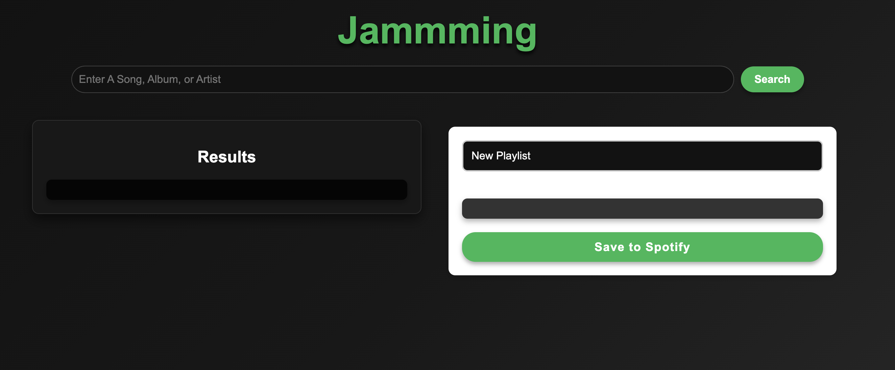
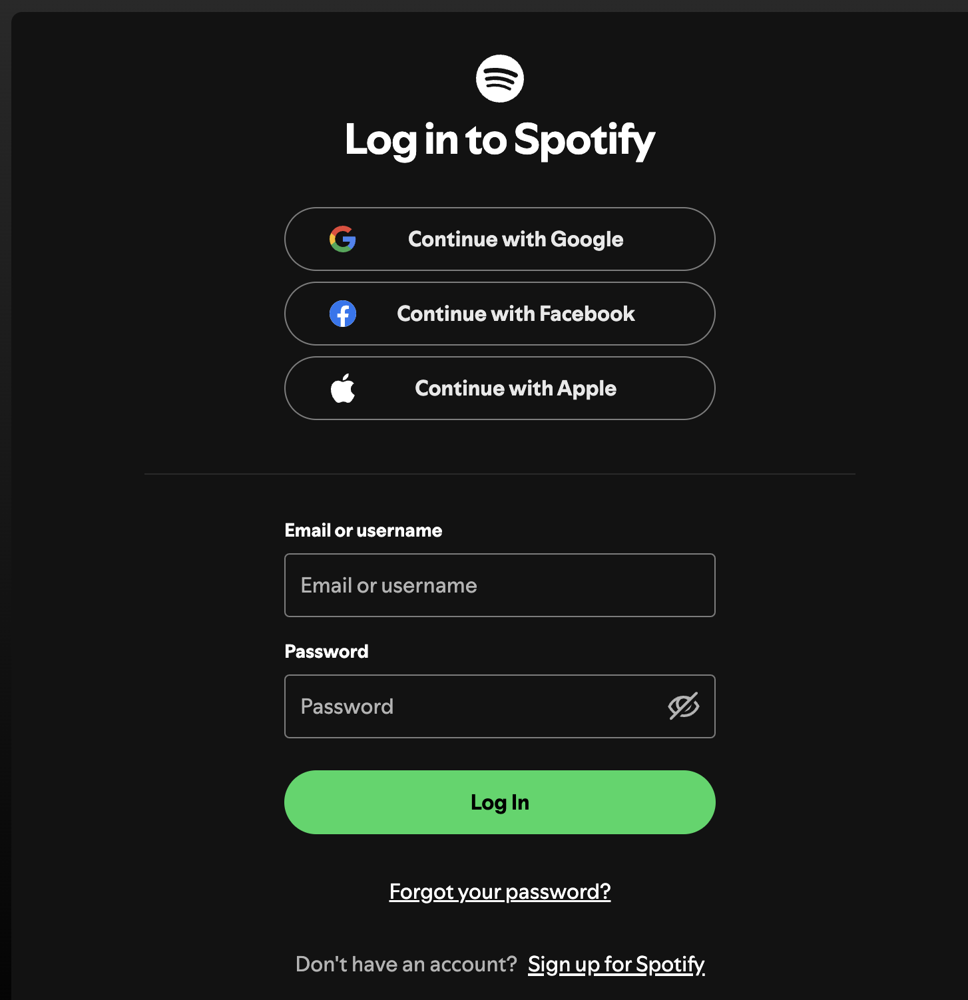
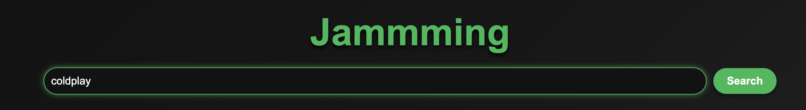
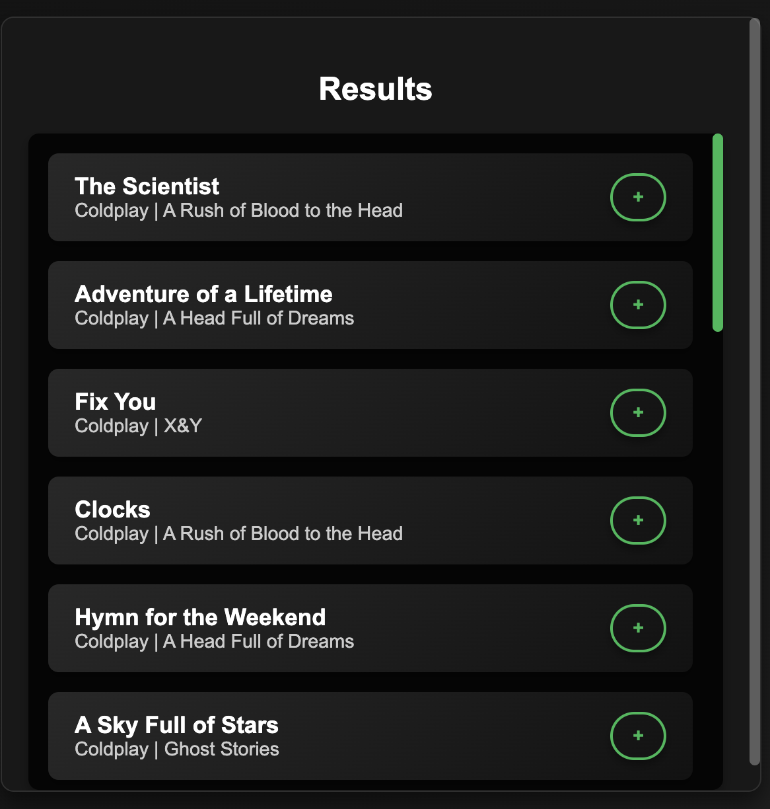
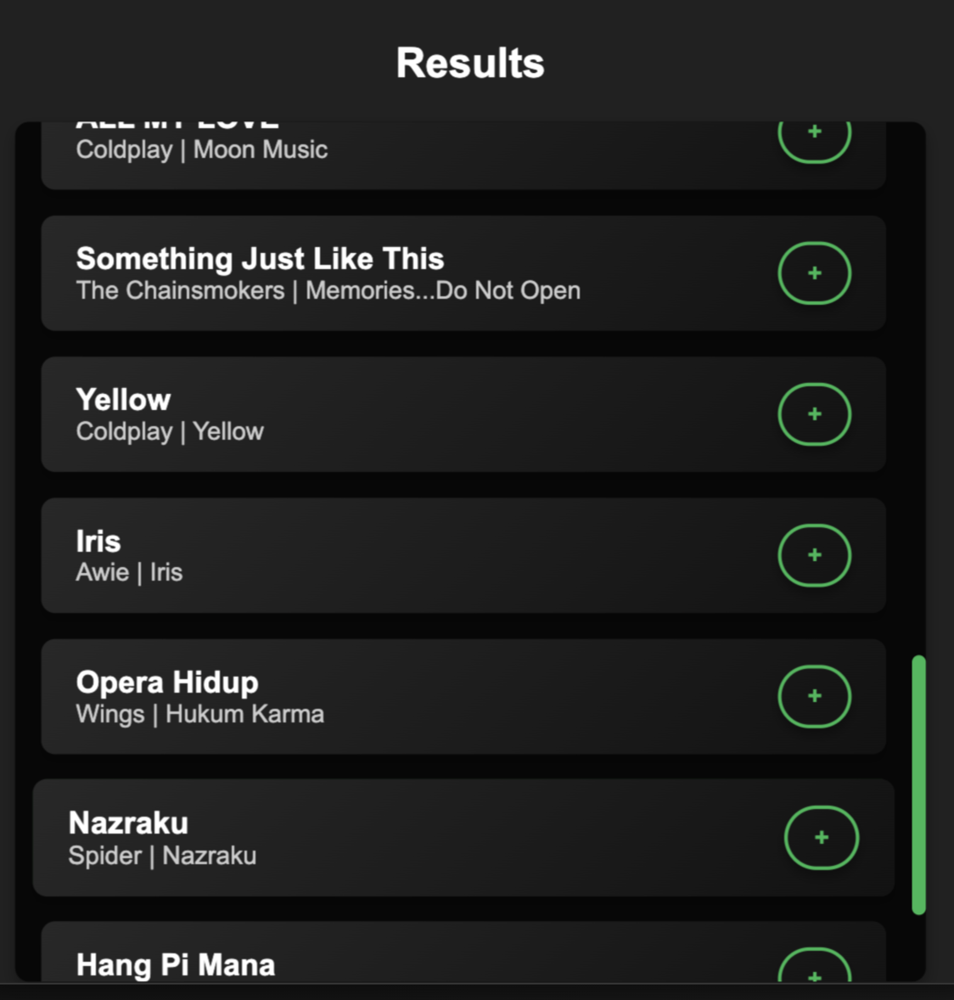
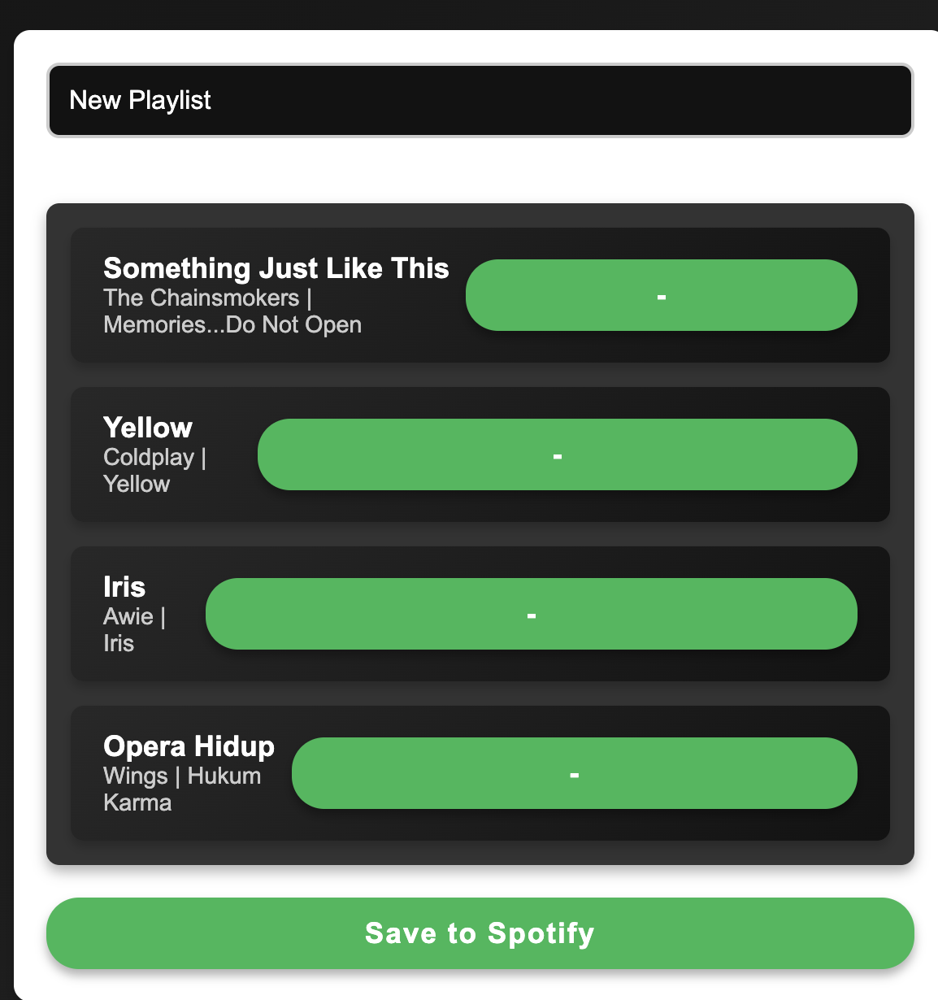
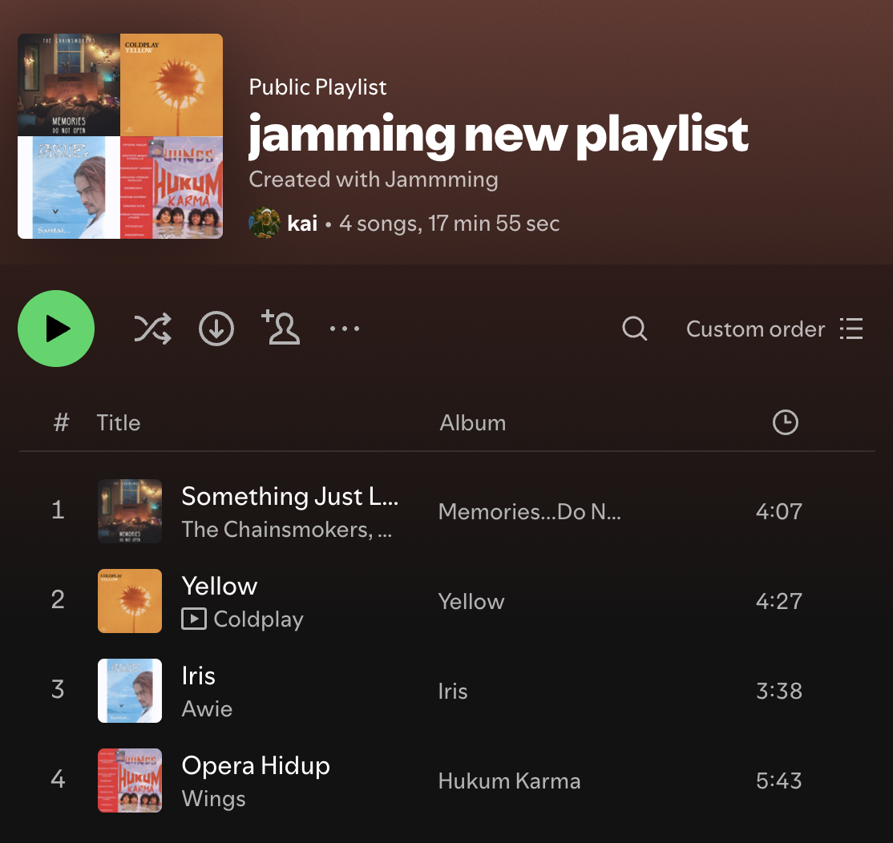

## Jammming 🎵

A modern React web application that connects to the Spotify API to allow users to search songs, build custom playlists, and save them directly to their Spotify account.

## Project Overview 🚀

Jammming is a fully functional React web app that integrates with Spotify’s API. Users can:
	•	Search for songs and artists using the Spotify library.
	•	Add tracks to a custom playlist.
	•	Remove tracks from the playlist.
	•	Save the playlist to their Spotify account with a custom name.

Jammming combines React functionality with API requests to provide a seamless music customization experience.

## Features 🎉
	•	Search Spotify’s Music Library: Users can search for any song, artist, or album.
	•	Custom Playlists: Build personalized playlists with your favorite tracks.
	•	Add or Remove Tracks: Easily add or remove tracks from your custom playlist.
	•	Save to Spotify: Save your playlists directly to your Spotify account.

## Technologies Used 🛠️

The project uses the following technologies:
	•	React: Component-based UI development.
	•	Spotify Web API: To search for tracks and create playlists.
	•	JavaScript (ES6+): For dynamic logic and API handling.
	•	CSS: Custom styling for a modern, Spotify-like design.
	•	HTML: For structure and layout.

## Setup Instructions 🔧

To run Jammming on your local machine:
	1.	Clone the repository: git clone https://github.com/TommyLau-bit/jammming.git
    cd jammming
	2.	Install dependencies: npm install
	3.	Run the application: npm start
	4.	Open your browser and navigate to: http://localhost:3000/
	5.	Authenticate your Spotify account to enable API functionality.

## How to Use Jammming 🎧
    1.	Log in with Spotify:
The app will redirect you to Spotify’s authentication page to get access to your account.
	2.	Search for Music:
Use the search bar to find songs by entering keywords like the song name, artist, or album.
	3.	Add Tracks to Your Playlist:
	    •	Click the “+” button next to a track to add it to your playlist.
	    •	The track will appear in the playlist section.
	4.	Remove Tracks:
	    •	Click the “-” button to remove a track from the playlist.
	5.	Save Playlist to Spotify:
        •	Enter a playlist name.
        •	Click the “Save to Spotify” button.
        •	The playlist will be created in your Spotify account with all selected tracks.

## Homepage

  
   
  <i>Figure 1: Homepage - A sleek and minimalist interface introduces users to the Jammming app.</i>

---

## Spotify Login Redirect

  
   
  <i>Figure 2: Spotify Login Redirect - Users are prompted to log into their Spotify account to authorize playlist access and saving.</i>

---

## Search Bar Glow Effect

  
   
  <i>Figure 3: Search Bar Glow Effect - A vibrant green highlight appears when the search bar is focused.</i>

---

## Search Results and Add Songs to Playlist

  
   
  <i>Figure 4: Search Results - Perform a search for songs, albums, or artists and add desired tracks to a custom playlist with a single click.</i>

---

## Search Results Scrolling with Sidebar

  
   
  <i>Figure 5: Scrollable Search Results - Easily browse through large lists of search results using the scrollable sidebar.</i>

---

## Playlist Management

  
   
  <i>Figure 6: Playlist Management - Customize the playlist name, view added tracks, remove songs, and save the playlist to Spotify.</i>

---

## Saved Playlist on Spotify

  
   
  <i>Figure 7: Saved Playlist - The custom playlist successfully saved and visible in the user's Spotify account.</i>

Author 👤

Tommy Lau
	•	GitHub: TommyLau-bit